# Small Business Loan Risk Analysis

Analysis of 899,164 SBA loans to identify default risk patterns by industry, location, and business characteristics.

**Goal:** Help lenders make better decisions by understanding which loan types are riskiest.

---

## What I Built

A data pipeline on AWS that:
1. Stores loan data in S3
2. Catalogs it with AWS Glue
3. Analyzes it with SQL in Athena
4. Identifies high-risk lending patterns

---

## Key Findings

**Overall default rate: 16.74%**

But it varies A LOT:
- Finance sector: 27.46% defaults
- Manufacturing: 19.55% defaults
- New businesses: 18.29% defaults
- Established businesses (>2 years): 2.04% defaults

**Biggest insight:** Business age matters way more than loan size. New businesses default 9x more than established ones.

---

## Technologies Used

- **AWS S3** - stored 171MB dataset
- **AWS Glue** - automated data cataloging
- **Amazon Athena** - SQL queries on cloud data
- **SQL** - wrote 9 analysis queries

---

## Dataset

- Source: U.S. Small Business Administration loan data (Kaggle)
- Size: 899,164 loan records
- Columns: 27 (loan amount, industry, location, default status, etc.)

---

## Top Insights

### 1. Industry Risk
Finance and Real Estate loans default 40% more than average.

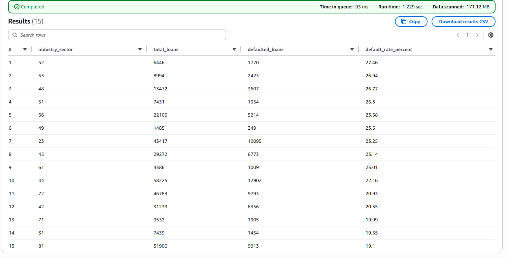

### 2. Geographic Risk
DC and Florida have the highest default rates (28% and 25%).

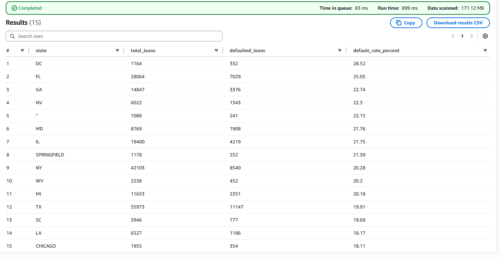

### 3. Business Maturity
Established businesses rarely default (2%). New startups default often (18%).

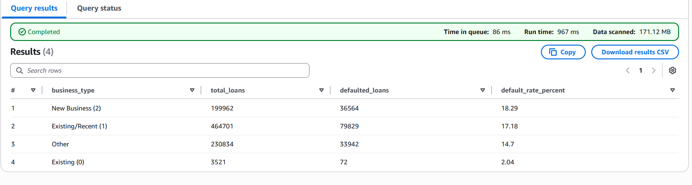

### 4. Loan Size
Small loans (<$50K) actually default MORE than large ones. Counterintuitive but true.

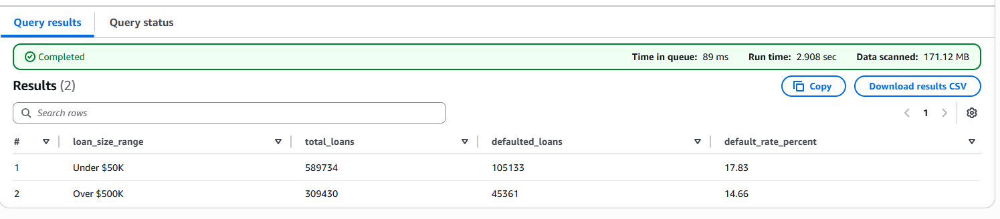

---

## Business Recommendations

1. **Charge higher rates** for Finance/Real Estate sectors
2. **Require more documentation** for new businesses
3. **Don't fast-track small loans** - they're riskier than they seem
4. **Focus on established businesses** - much safer

---

## Project Architecture

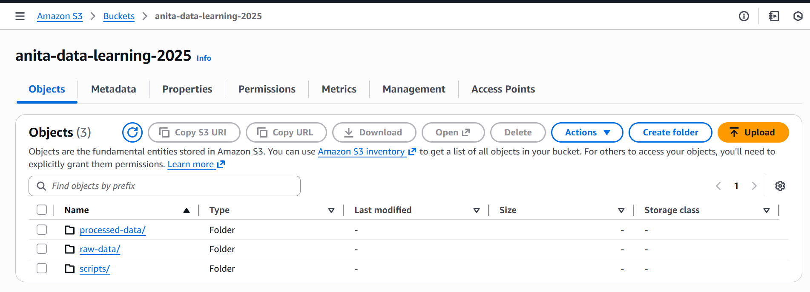
*Data stored in organized S3 folders*

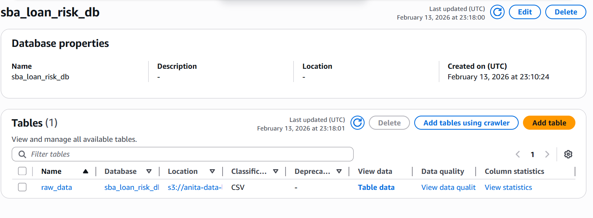
*AWS Glue automatically cataloged 27 data columns*

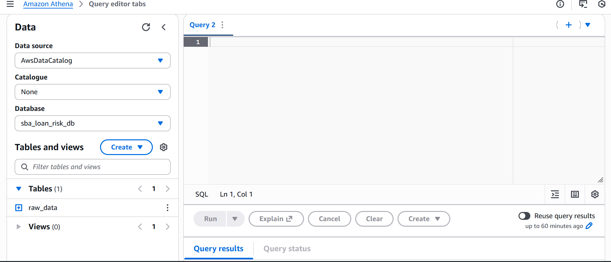
*Running SQL queries on 899K loan records*

---

## Project Structure
```
├── README.md
├── sql/
│   └── analysis_queries.sql       # All SQL queries used
├── screenshots/
│   ├── 02_s3_setup/
│   ├── 03_glue_catalog/
│   └── 04_athena_queries/
└── docs/
    └── key_insights_summary.md    # Detailed findings
```

---

## How to Run This

**Prerequisites:**
- AWS account (free tier works)
- Dataset from [Kaggle](https://www.kaggle.com/datasets/mirbektoktogaraev/should-this-loan-be-approved-or-denied)

**Steps:**
1. Create S3 bucket and upload dataset
2. Set up Glue crawler to catalog data
3. Configure Athena query location
4. Run queries from `sql/analysis_queries.sql`

---

## What I Learned

- How to build data pipelines on AWS
- SQL for analyzing large datasets (900K+ rows)
- Translating data into business recommendations
- Managing cloud costs (stayed under $5 total)

---

## Sample Query

Here's how I found default rates by industry:
```sql
SELECT 
    SUBSTR(CAST(naics AS VARCHAR), 1, 2) as industry_sector,
    COUNT(*) as total_loans,
    ROUND(100.0 * SUM(CASE WHEN chgoffdate IS NULL 
                           OR chgoffdate = 'N' 
                           THEN 0 ELSE 1 END) / COUNT(*), 2) as default_rate
FROM raw_data
WHERE naics IS NOT NULL
GROUP BY SUBSTR(CAST(naics AS VARCHAR), 1, 2)
ORDER BY default_rate DESC;
```

---

## Contact

**Anita Chelladurai**

[Add your email/LinkedIn when you publish]

---

## All Screenshots

### Setup Process

**S3 Data Upload:**
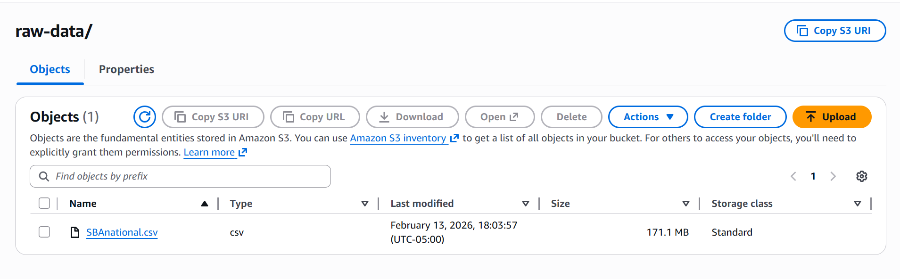

**Glue Crawler Configuration:**
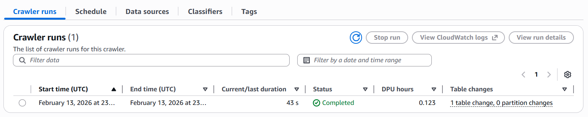

**Data Schema Discovery:**
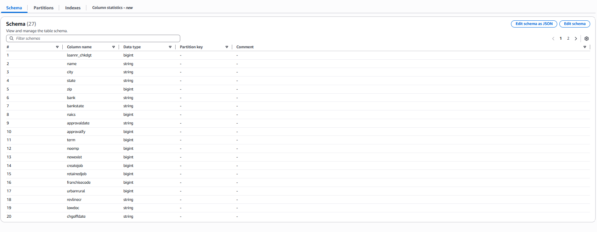

### Analysis Results

**Overall Default Rate (16.74%):**
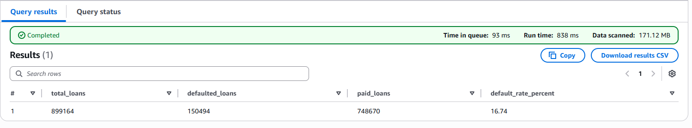

**First 10 Loan Records:**
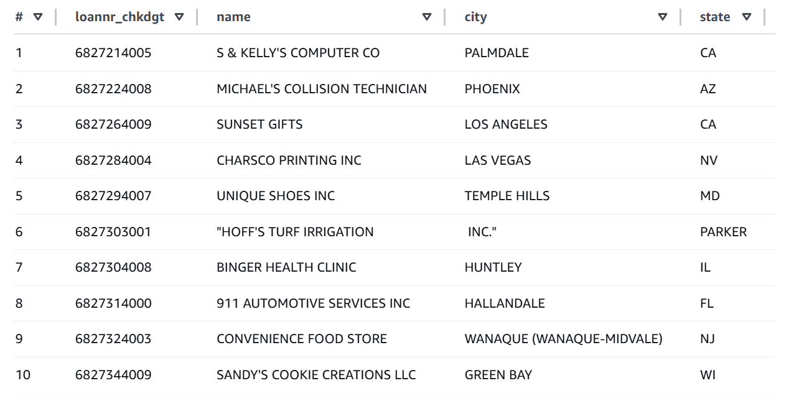

**Key Data Columns:**
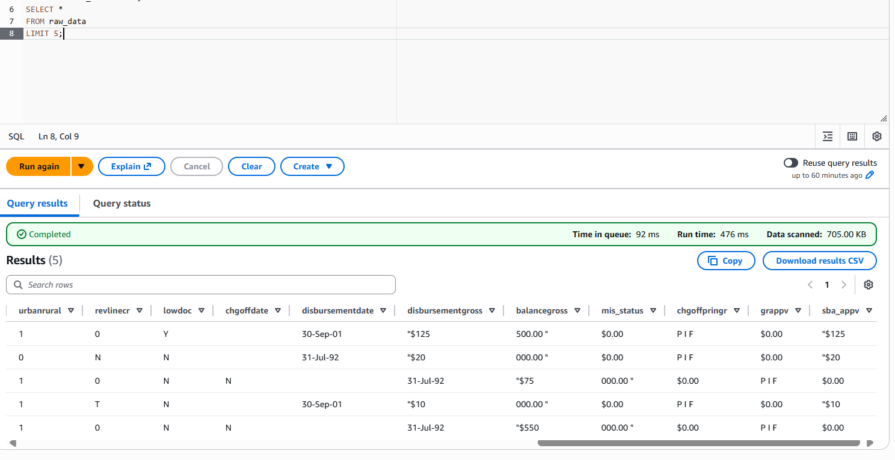

*See `screenshots/` folder for all project screenshots.*

---

**Note:** This uses public SBA data. All analysis follows AWS free tier limits.